Visual Gallery
==============

This gallery showcases the various types of lightcurves that can be generated using the hypothesis-lightcurves package. Each example includes the visualization, the code to generate it, and key parameters used.

.. note::
   All examples shown here are generated using the Hypothesis property-based testing framework, which means each run may produce slightly different results while maintaining the specified properties.

Overview
--------

The hypothesis-lightcurves package provides several categories of lightcurve generators:

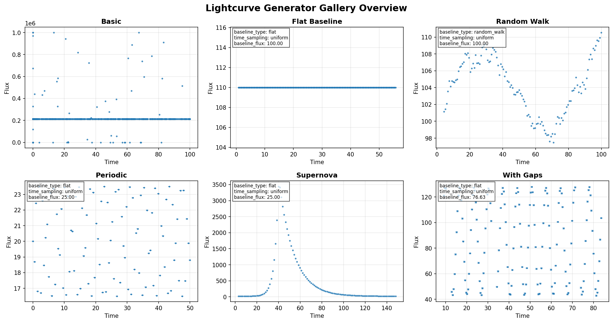

|

Basic Lightcurves
-----------------

Simple random lightcurves with customizable properties.

Random Lightcurve
~~~~~~~~~~~~~~~~~

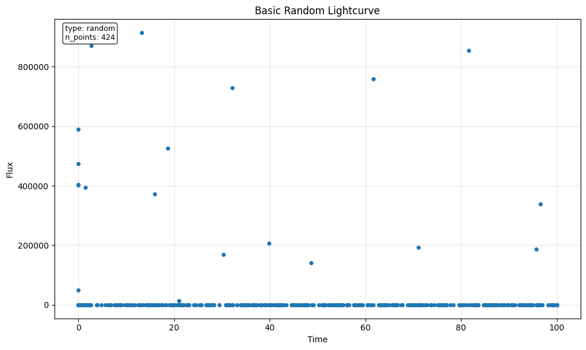

.. literalinclude:: _static/gallery/code/basic_random.py
   :language: python

Lightcurve with Errors
~~~~~~~~~~~~~~~~~~~~~~

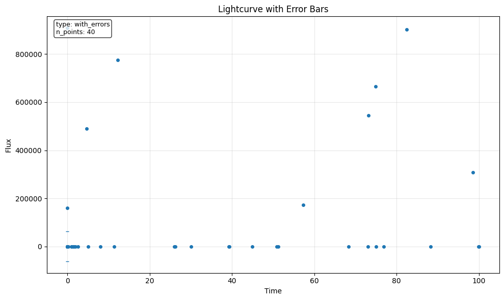

.. literalinclude:: _static/gallery/code/basic_with_errors.py
   :language: python

Baseline Patterns
-----------------

Different baseline patterns for testing detrending algorithms.

Flat Baseline
~~~~~~~~~~~~~

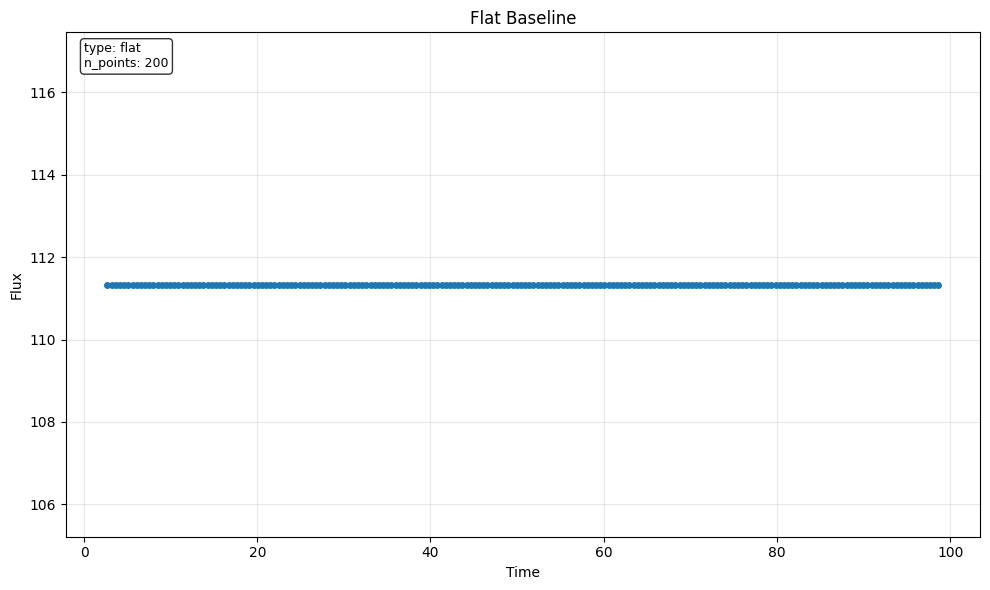

.. literalinclude:: _static/gallery/code/baseline_flat.py
   :language: python

Random Walk Baseline
~~~~~~~~~~~~~~~~~~~~

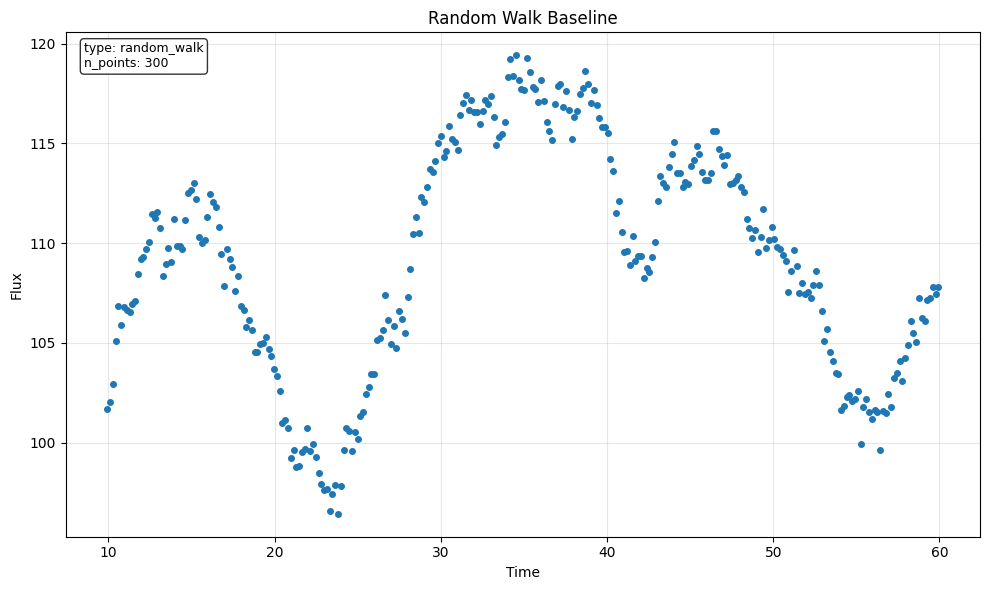

.. literalinclude:: _static/gallery/code/baseline_random_walk.py
   :language: python

Smooth Baseline
~~~~~~~~~~~~~~~

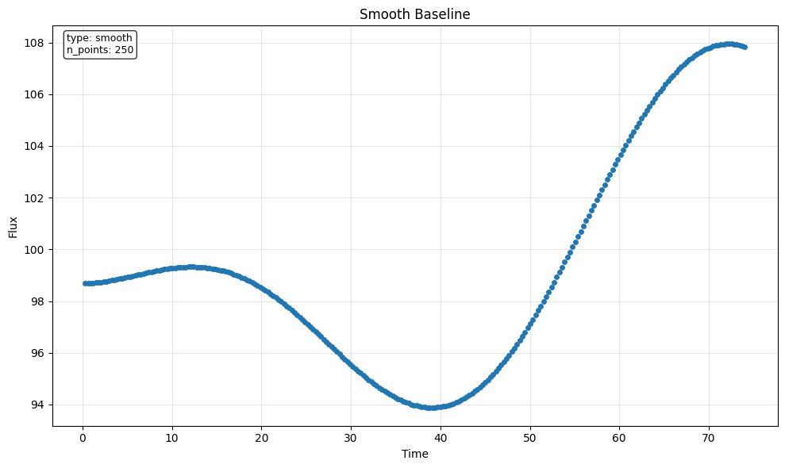

.. literalinclude:: _static/gallery/code/baseline_smooth.py
   :language: python

Periodic Signals
----------------

Lightcurves with periodic variations for testing period-finding algorithms.

Simple Periodic
~~~~~~~~~~~~~~~

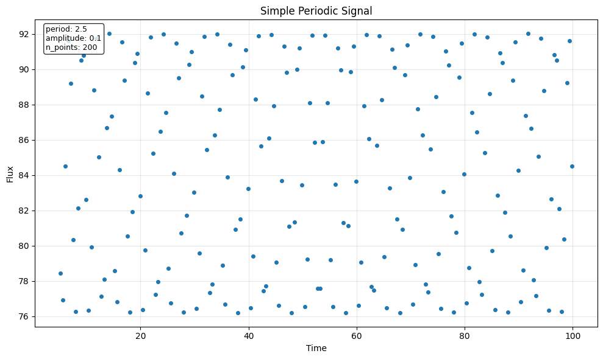

.. literalinclude:: _static/gallery/code/periodic_simple.py
   :language: python

Periodic with Noise
~~~~~~~~~~~~~~~~~~~

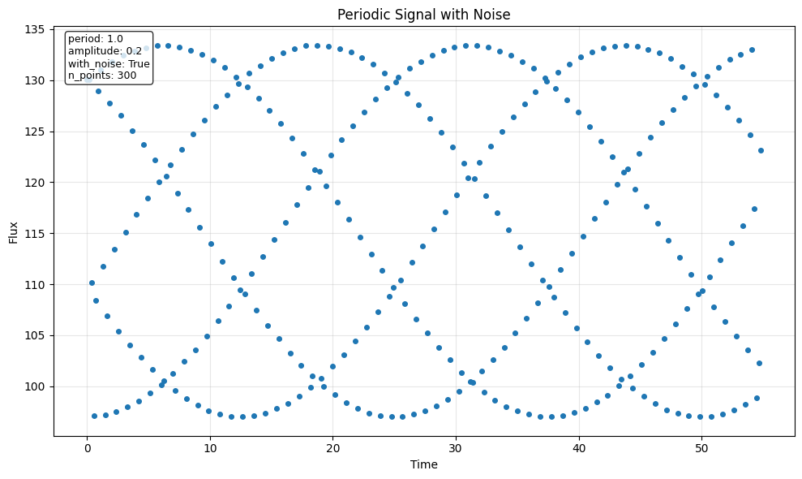

.. literalinclude:: _static/gallery/code/periodic_with_noise.py
   :language: python

Multi-periodic Signal
~~~~~~~~~~~~~~~~~~~~~

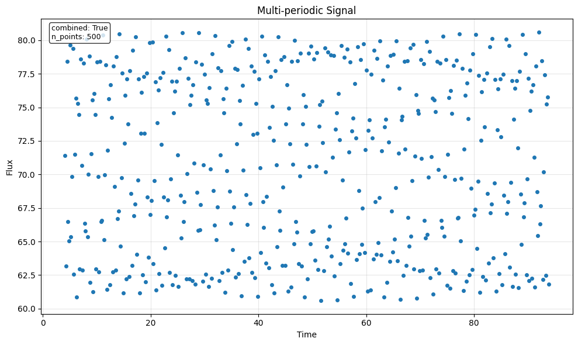

.. literalinclude:: _static/gallery/code/periodic_multi.py
   :language: python

Transient Events
----------------

Lightcurves with transient features like supernovae, flares, and eclipses.

Supernova-like Transient
~~~~~~~~~~~~~~~~~~~~~~~~~

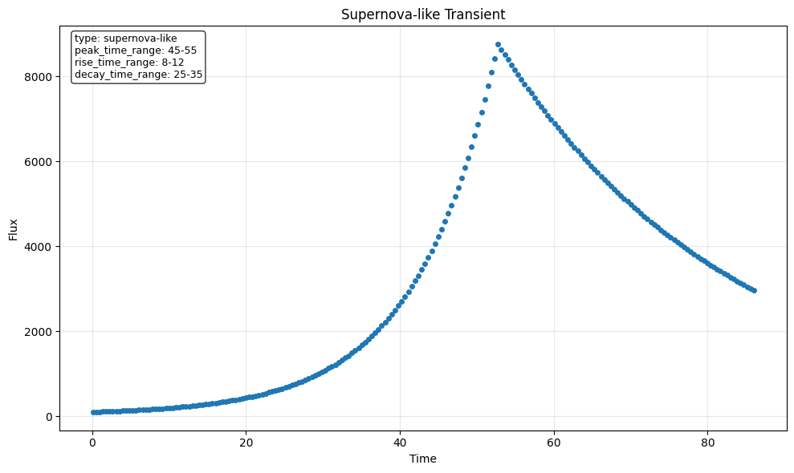

.. literalinclude:: _static/gallery/code/transient_supernova.py
   :language: python

Stellar Flare
~~~~~~~~~~~~~

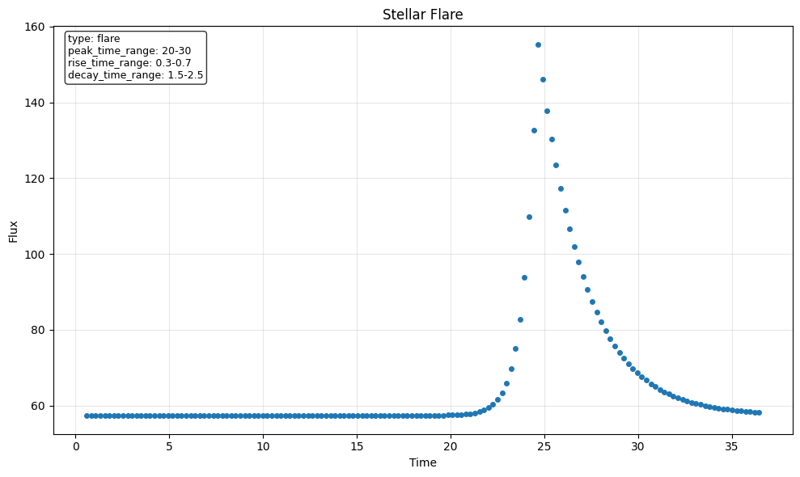

.. literalinclude:: _static/gallery/code/transient_flare.py
   :language: python

Eclipse-like Dip
~~~~~~~~~~~~~~~~

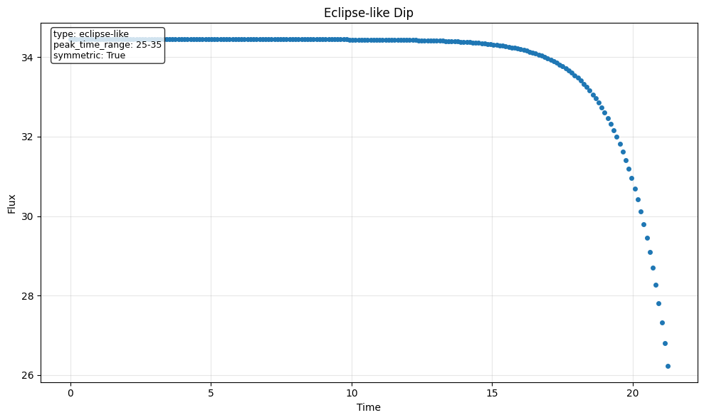

.. literalinclude:: _static/gallery/code/transient_eclipse.py
   :language: python

Modified Lightcurves
--------------------

Examples showing various modifications that can be applied to lightcurves.

Data Gaps
~~~~~~~~~

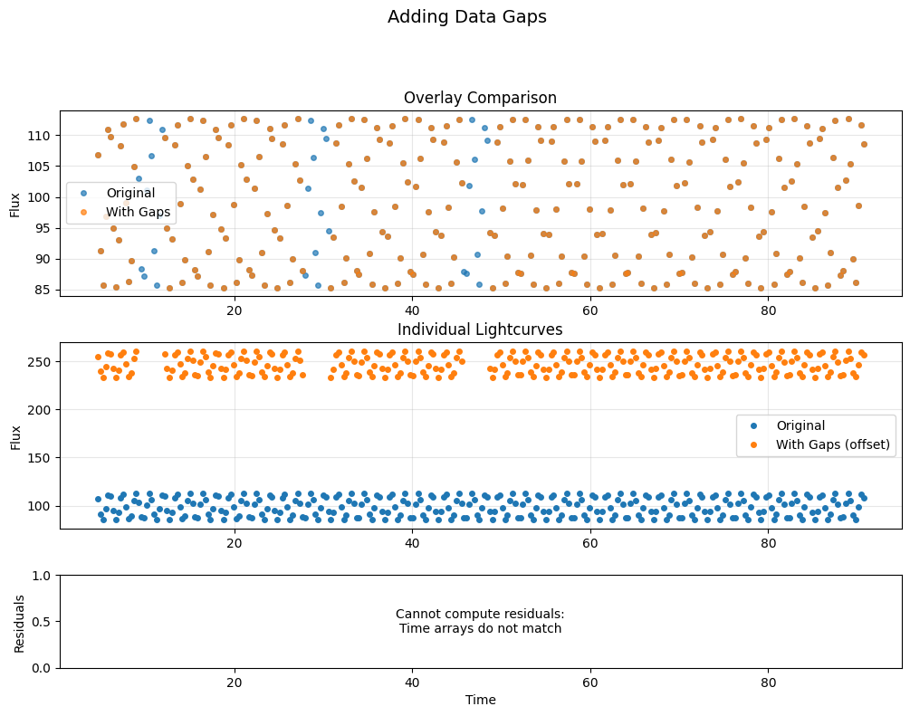

.. literalinclude:: _static/gallery/code/modified_gaps.py
   :language: python

Outliers
~~~~~~~~

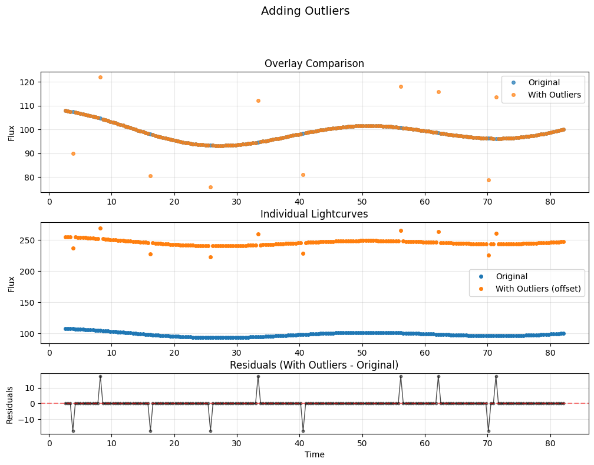

.. literalinclude:: _static/gallery/code/modified_outliers.py
   :language: python

Trend Addition
~~~~~~~~~~~~~~

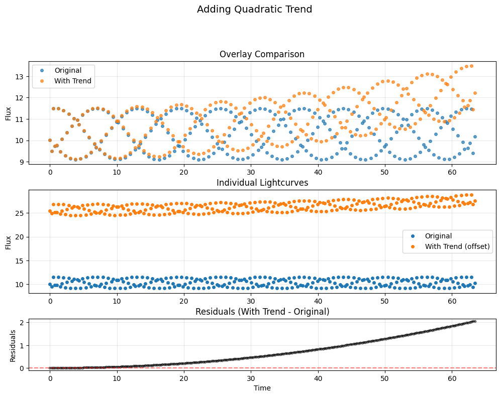

.. literalinclude:: _static/gallery/code/modified_trend.py
   :language: python

Composite Examples
------------------

Complex lightcurves combining multiple effects for realistic testing scenarios.

Realistic Observational Data
~~~~~~~~~~~~~~~~~~~~~~~~~~~~~

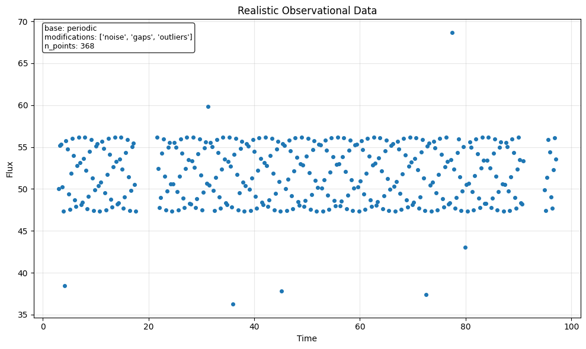

.. literalinclude:: _static/gallery/code/composite_realistic.py
   :language: python

Interactive Examples
--------------------

You can easily experiment with these generators in your own code:

.. code-block:: python

   from hypothesis import given
   from hypothesis_lightcurves.generators import lightcurves, periodic_lightcurves
   from hypothesis_lightcurves.modifiers import add_noise, add_gaps

   # Test with random lightcurves
   @given(lc=lightcurves())
   def test_my_algorithm(lc):
       result = my_algorithm(lc)
       assert result.is_valid()

   # Test with specific properties
   @given(lc=periodic_lightcurves(
       period=st.floats(0.5, 10.0),
       amplitude=st.floats(0.01, 0.5)
   ))
   def test_period_detection(lc):
       detected_period = find_period(lc)
       assert abs(detected_period - lc.metadata['period']) < 0.1

Creating Custom Visualizations
-------------------------------

The visualization module provides flexible plotting functions:

.. code-block:: python

   from hypothesis_lightcurves.visualization import (
       plot_lightcurve,
       plot_multiple_lightcurves,
       plot_lightcurve_comparison,
       create_gallery_figure
   )

   # Single lightcurve with customization
   fig, ax = plot_lightcurve(
       lc,
       color='red',
       marker='s',
       markersize=3,
       title="Custom Styled Plot"
   )

   # Compare original and modified
   fig, axes = plot_lightcurve_comparison(
       original_lc,
       modified_lc,
       label1="Before Processing",
       label2="After Processing"
   )

   # Grid of multiple lightcurves
   fig, axes = plot_multiple_lightcurves(
       [lc1, lc2, lc3, lc4],
       labels=["Type A", "Type B", "Type C", "Type D"],
       ncols=2
   )

Extending the Gallery
---------------------

To add new generator types to the gallery:

1. Create your generator in ``src/hypothesis_lightcurves/generators.py``
2. Add example generation to ``docs/scripts/generate_gallery.py``
3. Run ``nox -s docs`` to regenerate the gallery
4. The new examples will automatically appear in this gallery page

The gallery generation is automated and runs during documentation builds, ensuring examples stay up-to-date with the latest code changes.

.. note::
   All gallery images and code snippets are automatically generated from the actual package code, ensuring they remain accurate and functional.

See Also
--------

* :doc:`examples` - Detailed testing examples using these generators
* :doc:`api` - Complete API reference for all generators and modifiers
* :doc:`quickstart` - Getting started with hypothesis-lightcurves
